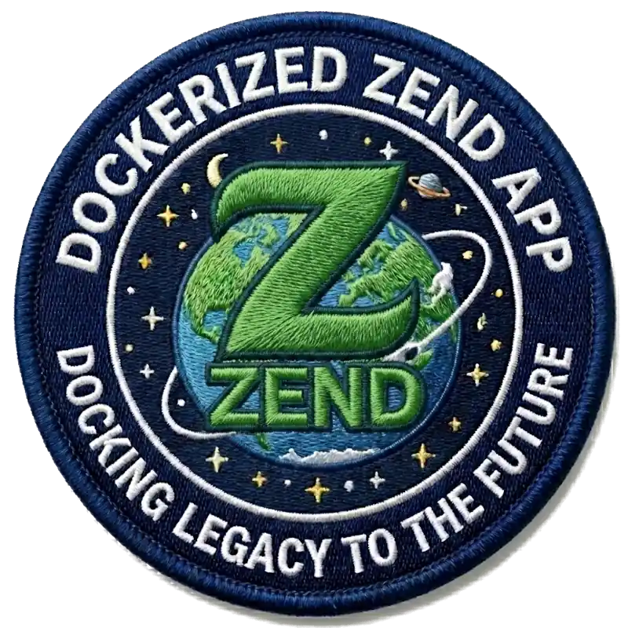

<p align="center">
  
</p>

<h1 align="center">Dockerized Legacy ZF1 App Stack</h1>

<p align="center">
  <strong>A modern, ultra-performance Docker orchestration for legacy Zend Framework 1.x apps.</strong>
</p>

<p align="center">
  <a href="file:///home/pinano/Documents/webroot/pinano-zend-app-dockerized/LICENSE"></a>
  
  
  
  
  
  
</p>

A modernized Docker stack for running legacy Zend Framework 1.x applications, featuring optimized performance, secure defaults, and easy management via `make`.

## Features
- **Configurable PHP Version**: Switch between PHP versions (e.g., 5.6, 7.4, 8.1) via `.env`.
- **MariaDB 12**: Latest stable database version.
- **Performance Tuned**: Optimized `opcache` and `realpath_cache` settings for ZF1.
- **Tmpfs Integration**: High-performance, ephemeral storage for ZF1 cache/sessions.
- **Secure by Default**: SFTP restricted to localhost, DB restricted to Docker bridge IP.
- **Traefik Ready**: Integrated labels for Traefik reverse proxy.
- **Advanced Flexibility**: Built-in support for Redis, Xdebug, Cronjobs, and custom PHP overrides.
- **Unified Management**: Simple `Makefile` for all common operations.

## Quickstart

1.  **Start the Stack**
    ```bash
    make start
    ```
    This will automatically copy `.env.dist` to `.env` if it doesn't exist and start the containers.

2.  **Access the Application**
    The application is configured to run behind Traefik (a reverse proxy).
    
    **If you have Traefik running on your host:**
    1. Ensure Traefik has an external Docker network named `traefik`.
    2. Access the app via your configured domain (e.g., `http://app-project.localhost`).
    
    **If you DON'T have Traefik:**
    1. Comment out the `traefik` network block in `docker-compose.yml`.
    2. Map the app's port explicitly (`ports: ["8080:8080"]`).
    3. Access the app via: `http://127.0.0.1:8080`.

3.  **Database Access**
    Connect specifically to the MariaDB console:
    ```bash
    make db
    ```
    You can also import and export database snapshots easily:
    ```bash
    make db export
    make db import <file.sql>
    ```

## Configuration

Configuration is managed via the `.env` file. Key variables include:

- `PROJECT_NAME`: Used for container naming and network isolation.
- `APP_ENV`: Application environment (`production` or `development`). **[Read the APP_ENV Guide here](docs/app_env.md).**
- `PHP_VERSION`: The PHP version tag for `serversideup/php` (e.g., `7.4`).
- `APACHE_DOCUMENT_ROOT`: Path to the public web root (default: `/var/www/html/public`).
- `DB_*`: Database credentials and settings.
- `SFTP_*`: SFTP user credentials.

### Scalability and Performance Tuning

The stack is designed to scale from small low-traffic sites to large applications. You can adjust the allocated resources and caching parameters in your `.env` file:

- **App Resources**: Limit CPU (`APP_CPUS`) and memory (`APP_MEMORY`) for the PHP container.
- **PHP Performance**: Configure OPcache (`PHP_OPCACHE_MEMORY_CONSUMPTION`, `PHP_OPCACHE_MAX_ACCELERATED_FILES`), input vars (`PHP_MAX_INPUT_VARS`), and FPM pool tuning (`PHP_FPM_PM_MAX_CHILDREN`, `PHP_FPM_PM_MAX_REQUESTS`) for faster and more stable execution.
- **Database Resources**: Assign CPU and memory limits to MariaDB (`DB_CPUS`, `DB_MEMORY`).
- **Database Tuning**: For high traffic, increase `DB_MAX_CONNECTIONS` and `DB_INNODB_BUFFER_POOL_SIZE` (crucial for InnoDB performance).
- **Cron Resources**: Configure CPU and memory limits for the cron container (`CRON_CPUS`, `CRON_MEMORY`).    

For detailed sizing profiles (Small/Medium/Large) and capacity planning, see the **[Sizing Guide](docs/sizing.md)**.

### Advanced Stack Control

You can enable additional stack features for specific legacy applications via `.env` or configuration files:

- **Optional Redis Cache**: Add `COMPOSE_PROFILES=redis` to your `.env` to automatically start a lightweight Redis container (powered by Valkey). **[Read the Full Redis Integration Guide here](docs/redis.md).**
- **Xdebug for Local Dev**: Set `PHP_XDEBUG_MODE=debug` (or another mode like `develop`) in your `.env`. Keep it disabled in production.
- **Cronjobs**: Schedule application tasks without connecting to the container by adding cron syntax to `docker/scripts/crontab`. A dedicated CLI container executes them automatically. **[Read the Cronjobs Guide here](docs/cron.md).**
- **Local PHP Overrides**: If a specific project needs an unusual PHP setting (e.g., `max_input_vars = 5000`), simply add it to `docker/php/custom.ini` without modifying the core image.
- **Verbose Logging**: Adjust `APACHE_LOG_LEVEL=debug` (or `warn` by default) in your `.env` to troubleshoot complex HTTP errors.
- **Application Error Logs**: ZF1 exceptions are caught by `ErrorController` and invisible in Docker logs by default. See **[Logging Guide](docs/logging.md)** for the required fix and best practices.

## Project Structure

```
.
├── docker/            # Docker configuration files (Apache, PHP, Scripts)
│   └── scripts/        
│       └── init-app.sh # Bootstrapper: Rebuilds /tmp structure automatically & generates healthcheck.php
├── docs/               # Guides (APP_ENV, Cron, Redis, Sizing)
├── docroot/            # Application source code
├── mariadb_data/       # Persistent database storage
├── .env                # Environment variables
├── docker-compose.yml  # Container orchestration config
└── Makefile            # Command task runner
```

## Management Commands

| Command | Description |
|---------|-------------|
| `make help` | Show all available commands |
| `make init` | Initialize environment (.env) |
| `make start` | Start the stack (creates/validates .env) |
| `make stop` | Stop the stack and cleanup orphans |
| `make restart` | Restart all containers |
| `make rebuild <svr>` | Rebuild all or specific service |
| `make status` | Show stack status (`docker compose ps`) |
| `make services` | List available services |
| `make validate` | Validate `.env` against minimum requirements |
| `make sync` | Synchronize `.env` with `.env.dist` (Add missing keys) |
| `make logs [svr]` | Container logs for all or a specific service (e.g. `app`, `db`) |
| `make logs-zend` | Follow the Zend Framework application log file directly |
| `make logs-php` | Follow the PHP-FPM error log file directly |
| `make logs-apache` | Follow Apache access and error logs |
| `make shell <svr>` | Access container shell (defaults to `app`) |
| `make pull` | Pull latest images |
| `make clean` | Clean configs and volumes (requires confirmation) |
| `make db` | Wait for MariaDB console, or use `import`/`export` |
| `make config` | Validate Docker Compose config |
| `make ctop` | Monitor containers using ctop |
| `make open-ports` | Expose DB & SFTP ports externally (0.0.0.0) |
| `make close-ports` | Restrict DB (172.17.0.1) & SFTP (127.0.0.1) |
| `make open-db` / `close-db` | Expose or restrict only the DB |
| `make open-sftp` / `close-sftp` | Expose or restrict only SFTP |
| `make redis-info` | Show Redis server statistics |
| `make redis-monitor`| Monitor Redis commands in real-time |
| `make redis-ping`   | Ping Redis server |
| `make crontab-init` | Create example crontab file |
| `make size-xs` | Apply Extra Small sizing profile (Dev/Hobby) |
| `make size-s` | Apply Small sizing profile (Staging/Low traffic) |
| `make size-m` | Apply Medium sizing profile (Small Production) |
| `make size-l` | Apply Large sizing profile (Standard Production) |
| `make size-xl` | Apply Extra Large sizing profile (High Production) |
| `make size-xxl` | Apply Double Extra Large sizing profile (Critical Production) |
| `make size-show` | Show current sizing config |

## Services

- **app**: PHP-FPM + Apache (serversideup/php image).
- **cron**: CLI container to run scheduled tasks.
- **db**: MariaDB 12.2.2.
- **sftp**: Secure file transfer (linuxserver/openssh-server), restricted to localhost.
- **redis** (Optional): In-memory cache store (Powered by Valkey).

## License

This project is open-source and licensed under the [MIT License](LICENSE).
